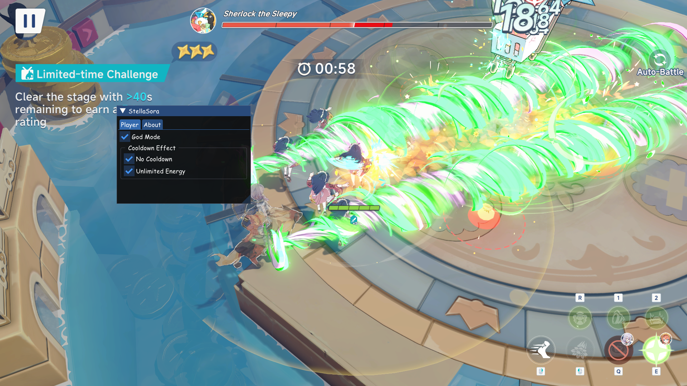

## Stella Sora Cheat

<a href="https://discord.gg/vQeDRXEQae">
  
  <b>Join Discord</b>
</a>

## Usage
<details>
<summary>Instruction</summary>


1. Inject the DLL to the game with your preferred injector
2. Press F1 to show the menu
</details>

## Features
- Instant Break
- God Mode
- Multi Hit
- No Cooldown
- Unlimited Energy
- Mob Vacuum

## Contributing
1. Fork the repo (<https://github.com/TheReVeaLz/StellaSora-Tool/fork>).
2. Create your feature branch.
3. Commit your changes.
4. Push your changes to the branch.
5. Create a new pull request.

## Donation
If this project helps you, consider supporting through a Monero cryptocurrency.

### Direct Monero Address
```text
48nT6ukaNUaBnEr1WKQkEbjE244M2w27RHpTDdqgA3TZ2mSVcJSb8FCQaXtfz4EAaxXWqFrFVjFAjTsrB6sVk9vCL1t6rh8
```
#### QR Code
<a href="monero:48nT6ukaNUaBnEr1WKQkEbjE244M2w27RHpTDdqgA3TZ2mSVcJSb8FCQaXtfz4EAaxXWqFrFVjFAjTsrB6sVk9vCL1t6rh8">
  
</a>

### Instant Exchanges
If you do not hold Monero, you can instantly swap other cryptocurrencies (like BTC, ETH, or LTC) directly to the address above using these privacy-friendly, non-custodial providers:

* **[FixedFloat](https://ff.io)** – Fast automated swap with low fees.
* **[ChangeNOW](https://changenow.io)** – Limitless registration-free crypto exchange.
* **[Trocador.app](https://trocador.app)** – An aggregator that finds the cheapest and most private swap route.